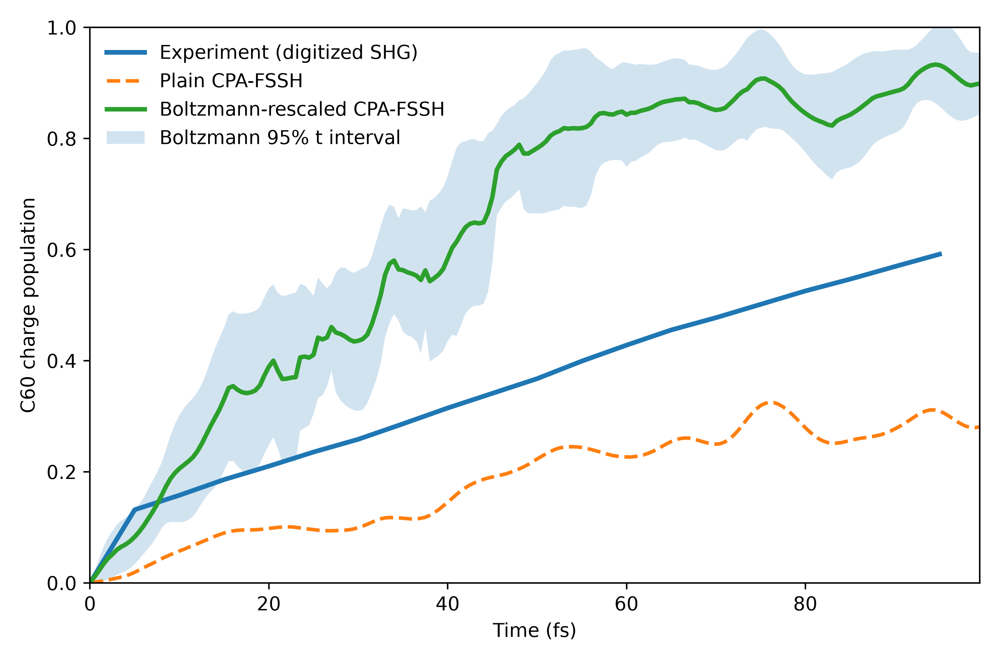
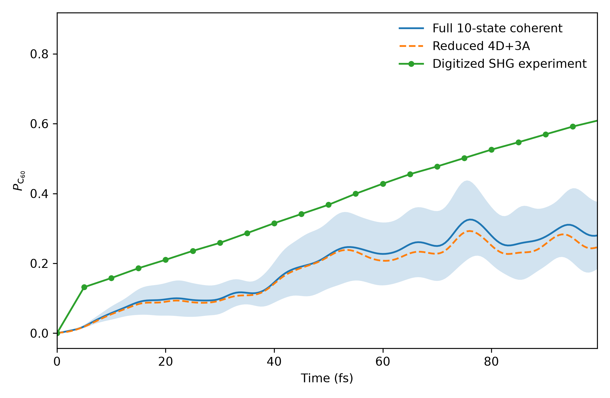
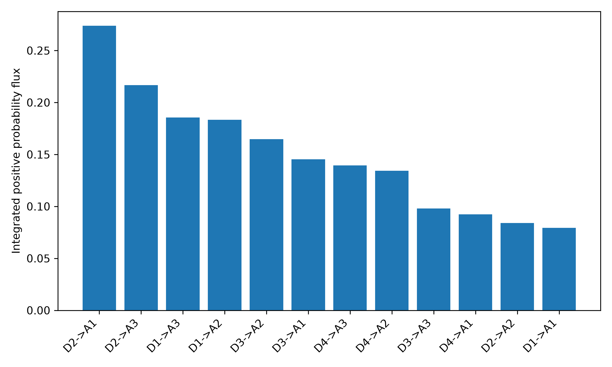
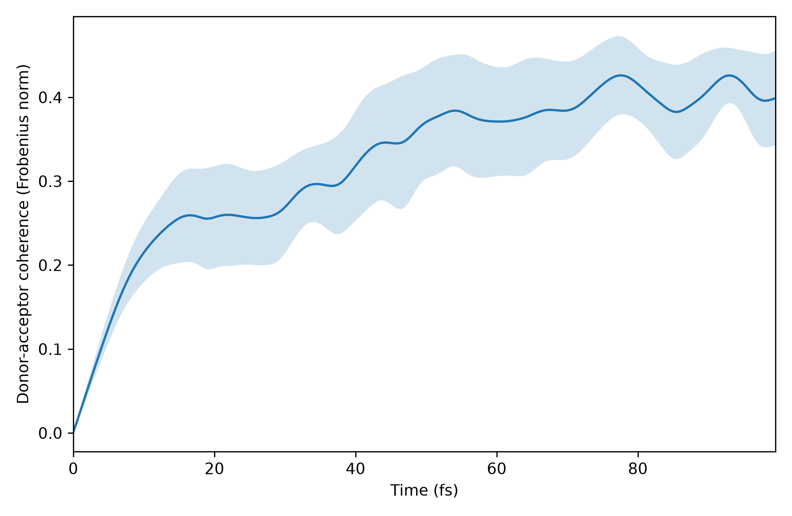

# First-principles charge-transfer dynamics in 2H2Pc/C60

[](https://github.com/amiraminitamu/Summer-School-Buffalo/actions/workflows/quality.yml)
[](https://github.com/amiraminitamu/Summer-School-Buffalo/actions/workflows/build-report.yml)

A reproducible theoretical-chemistry workflow for photoinduced charge transfer from a free-base phthalocyanine dimer donor (`2H2Pc`) to a fullerene acceptor (`C60`). It combines PySCF molecular dynamics and electronic structure, cross-geometry orbital tracking, exact unitary propagation in a finite active space, Libra classical-path fewest-switches surface hopping, and a fragment-adapted reduced Hamiltonian with pathway-resolved probability currents.

> **Scope:** this is exclusively a theoretical charge-transport study. It contains no cybersecurity analysis and no biological modeling.

## Scientific question

How do coherent electronic dynamics, stochastic surface hopping, detailed balance, and active-space reduction affect the predicted early-time C60 charge population in the 176-atom `2H2Pc/C60` complex?

```text
10 x 100 fs PySCF AIMD trajectories
        |
        v
KS orbitals + C60 projectors at 2,000 snapshots
        |
        v
orbital tracking + matrix-log derivative couplings
        |
        +----------------------+
        |                      |
        v                      v
exact 10-state unitary      Libra CPA-FSSH
propagation                 plain / Boltzmann
        |
        v
validated 4 donor + 3 acceptor Hamiltonian
        |
        v
coherence and donor-to-acceptor probability currents
```

## Main findings

| Result | Value |
|---|---:|
| Minimum consecutive-overlap singular value | `0.999580` |
| Full 10-state coherent C60 population at 99.5 fs | `0.2798 +/- 0.0963` |
| Reduced 4D+3A C60 population at 99.5 fs | `0.2462 +/- 0.0882` |
| Full-versus-reduced ensemble RMSE | `0.01830` |
| Plain CPA-FSSH endpoint | `0.28085` |
| Boltzmann-rescaled CPA-FSSH endpoint | `0.89890` |
| Digitized experimental endpoint | `0.60857` |
| Maximum mean donor-acceptor coherence | `0.4262` at `77.5 fs` |
| Dominant positive-flux channel | `D2 -> A1` (`0.2739`) |

The experiment lies between the plain and Boltzmann-rescaled surface-hopping predictions. The reduced model closely follows the full coherent ensemble, while the channel analysis shows strong recrossing rather than simple one-way transfer.

## Key figures

### Detailed-balance sensitivity



### Full versus reduced coherent dynamics



### Pathway-resolved transfer



### Donor-acceptor coherence



## Repository layout

| Path | Purpose |
|---|---|
| `data/` | Geometry, fragment map, exact production starts, and digitized experiment |
| `src/` | All Python and Slurm source code, ordered by execution stage |
| `docs/` | Scientific method, reproducibility, and result interpretation |
| `results/` | Compact numerical outputs and original publication-ready figures |
| `report/` | Capstone report in LaTeX and PDF |

The initial frontier analysis, PySCF/geomeTRIC relaxation, production-start extraction, AIMD, electronic extraction, state tracking, Libra calculations, reduced model, and final analyses are all retained under [`src/`](src/).

## Quick validation

```bash
git clone https://github.com/amiraminitamu/Summer-School-Buffalo.git
cd Summer-School-Buffalo
git switch submission-ready

conda env create -f environment-pyscf.yml
conda activate pc60-pyscf
make check
```

## Calculation sequence

All commands are run from the repository root.

### 1. Initial structure and orbital checks

```bash
python src/00_validate_geometry.py
sbatch src/slurm/00_initialization.slurm
```

The exact ten production starting structures are tracked under `data/production_starts/`. Their source frames are listed in `manifest.csv`. To repeat the extraction from the corresponding thermalization trajectory:

```bash
python src/03_prepare_replicas.py \
  --trajectory output_thermalization/aimd.md.xyz
```

### 2. Production AIMD and electronic Hamiltonians

```bash
sbatch src/slurm/01_aimd_array.slurm
sbatch src/slurm/02_electronic_array.slurm
sbatch src/slurm/03_tracking_array.slurm
```

### 3. Libra CPA-FSSH

```bash
sbatch src/slurm/04_libra_array.slurm

BOLTZMANN=1 OUTROOT=output_libra/fssh_boltzmann \
  sbatch src/slurm/04_libra_array.slurm
```

### 4. Analysis

```bash
python src/08_analyze_fssh.py \
  --root output_libra/fssh --ntraj 10

python src/09_build_reduced_model.py \
  --root output_tracked --ntraj 10

python src/10_plot_libra_experiment.py \
  --libra-root output_libra/fssh \
  --tracked-root output_tracked \
  --experiment data/experiment_shg_digitized.csv \
  --outdir output_libra/final_figures \
  --ntraj 10

python src/11_compare_fssh_variants.py \
  --plain-root output_libra/fssh \
  --boltzmann-root output_libra/fssh_boltzmann \
  --tracked-root output_tracked \
  --experiment data/experiment_shg_digitized.csv \
  --outdir output_libra/final_figures_boltzmann \
  --ntraj 10

python src/12_analyze_coherent_mechanism.py \
  --root output_reduced_4d3a \
  --ntraj 10 \
  --experiment data/experiment_shg_digitized.csv \
  --outdir output_coherent_mechanism
```

## Terminology

No TDDFT calculation was performed. The nonadiabatic quantities are Kohn-Sham orbital time-derivative couplings obtained from cross-geometry overlaps. “Exact coherent propagation” means numerically exact matrix-exponential propagation within the specified finite, trajectory-dependent active-space Hamiltonian; it is not exact many-electron molecular dynamics.

`data/experiment_shg_digitized.csv` is an approximate digitization of the black SHG curve in Figure 3A of Yamijala and Huo, *J. Phys. Chem. A* **2021**, 125, 628–635. It is not the original raw experimental dataset and has no original experimental error bars.

## Report, citation, and license

- [Compiled report](report/Project_Report.pdf)
- [LaTeX source](report/Project_Report.tex)
- [Citation metadata](CITATION.cff)

Source code is released under the MIT License. Published molecular coordinates and literature-derived data retain their original attribution.
